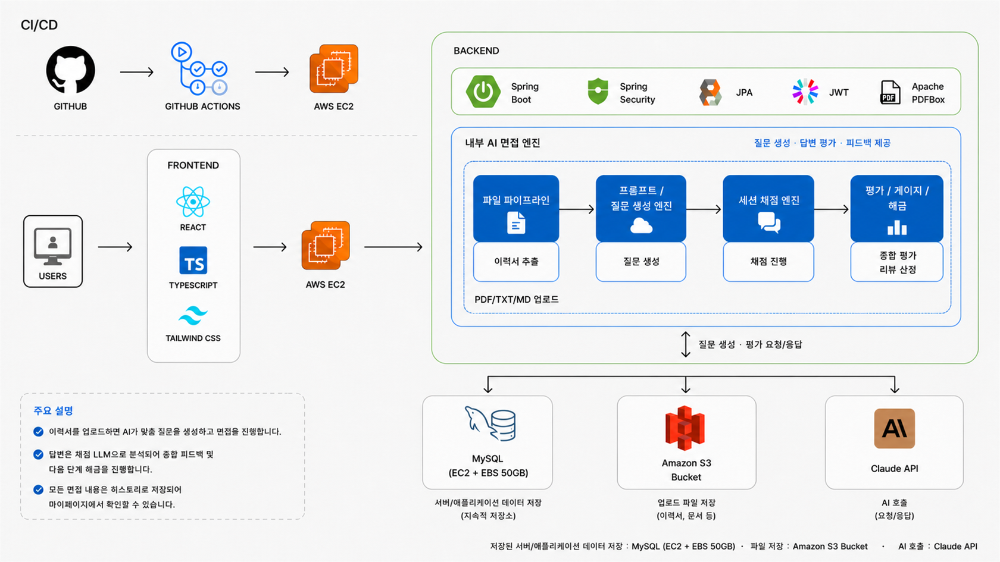

<div align="center">
  
  <h1>Career Dungeon</h1>
  <p><strong>이력서에서 시작해 실전 답변력을 성장시키는 AI 면접관 성장 시뮬레이터</strong></p>
  <p>
    문서 기반 맞춤 질문과 꼬리질문에 답하고,<br/>
    평가 결과로 신뢰도 게이지를 채워 다음 면접관을 해금합니다.
  </p>
  <p><code>Backend</code></p>
</div>

<br/>

## 목차

1. [팀 소개](#팀-소개)
2. [개발 배경](#개발-배경)
3. [서비스 흐름](#서비스-흐름)
4. [시스템 아키텍처](#시스템-아키텍처)
5. [주요 기능](#주요-기능)
6. [기술 스택](#기술-스택)
7. [로컬 실행](#로컬-실행)
8. [검증](#검증)
9. [프로젝트 구조](#프로젝트-구조)

<br/>

## 팀 소개

<table align="center">
  <tr>
    <td align="center"><a href="https://github.com/Lee1sd"></a></td>
    <td align="center"><a href="https://github.com/lei-3m"></a></td>
    <td align="center"><a href="https://github.com/yongseong123"></a></td>
    <td align="center"><a href="https://github.com/JIMIN-1211"></a></td>
  </tr>
  <tr>
    <td align="center"><a href="https://github.com/Lee1sd"><strong>이건희</strong></a></td>
    <td align="center"><a href="https://github.com/lei-3m"><strong>김한비</strong></a></td>
    <td align="center"><a href="https://github.com/yongseong123"><strong>최용성</strong></a></td>
    <td align="center"><a href="https://github.com/JIMIN-1211"><strong>표지민</strong></a></td>
  </tr>
  <tr>
    <td align="center">파일파이프라인</td>
    <td align="center">면접 엔진 + LLM</td>
    <td align="center">평가 · 게이지 · 해금</td>
    <td align="center">인증 + 인프라 + FE</td>
  </tr>
</table>

<br/>

## 개발 배경

기존 AI 모의면접은 질문과 답변, 피드백이 한 번에 끝나는 경우가 많아 반복 학습의 동기가
약합니다. 또한 범용 질문만으로는 지원자의 실제 이력서에서 이어질 꼬리질문을 충분히
연습하기 어렵습니다.

Career Dungeon은 이력서와 포트폴리오에서 질문 소재를 찾고, 직전 답변의 약점을 파고드는
꼬리질문과 게임형 해금 구조를 결합했습니다.

- **문서 기반 맞춤 질문** — 업로드한 이력서·포트폴리오를 바탕으로 질문 생성
- **실전형 꼬리질문** — 최초 답변 중 보완이 필요한 문항을 대상으로 후속 질문 제공
- **성장 피드백** — 문항별 평가, 종합 피드백, 신뢰도 게이지로 답변 수준 시각화
- **반복 동기** — 면접관, 레벨, 뱃지 해금으로 학습 과정을 게임처럼 구성

<br/>

## 서비스 흐름

1. Google 계정으로 로그인합니다.
2. 이력서 또는 포트폴리오를 업로드합니다.
3. 해금된 AI 면접관과 연습할 기술 주제를 선택합니다.
4. 문서 기반 질문에 답하고, 선택된 약점 문항의 꼬리질문에 답합니다.
5. 문항별 점수와 종합 피드백을 확인합니다.
6. 합격 기준을 충족하면 신뢰도 게이지가 오르고 다음 레벨과 뱃지가 해금됩니다.
7. 마이페이지에서 진행도, 뱃지, 면접 히스토리를 확인합니다.

<br/>

## 시스템 아키텍처

<div align="center">
  
</div>

### 주요 아키텍처 특징

- **CI/CD** — GitHub Actions가 백엔드 JAR를 빌드하고 AWS EC2 배포 및 재시작을 수행합니다.
- **도메인 중심 모놀리스** — 인증, 이력서, 면접, 메시지, 평가, 진행도 도메인을 하나의
  Spring Boot 애플리케이션 안에서 명확한 경계로 분리합니다.
- **내부 AI 면접 엔진** — 파일 파이프라인, 질문 생성, 면접 세션, 평가·게이지·해금 단계가
  순차적으로 협력하며 Claude API 호출은 추상화된 LLM 경계를 통해 수행합니다.
- **데이터 분리** — 애플리케이션 데이터는 MySQL에, 업로드 파일은 private Amazon S3에
  저장합니다.
- **인증과 접근 제어** — Google OAuth2, Spring Security, JWT로 사용자 인증과
  도메인별 접근 권한을 관리합니다.

프론트엔드 저장소:
[Programmers-Intern-Program/INT2_Team3_careerdungeon_FE](https://github.com/Programmers-Intern-Program/INT2_Team3_careerdungeon_FE.git)

<br/>

## 주요 기능

<details>
<summary><strong>인증과 사용자 관리</strong></summary>

<br/>

- Google OAuth2 로그인
- JWT Access Token과 HttpOnly Refresh Token 기반 세션 유지
- 사용자 프로필 조회·수정 및 회원 탈퇴
- 인증이 필요한 API의 사용자 소유권 검증

</details>

<details>
<summary><strong>이력서·포트폴리오 파이프라인</strong></summary>

<br/>

- Presigned PUT URL을 이용한 private S3 직접 업로드
- PDF, TXT, MD 형식과 파일 크기 검증
- PDFBox 또는 UTF-8 기반 텍스트 추출
- 이메일 등 민감정보 마스킹과 원본 파일 정리
- 파싱 상태 조회와 실패 처리

</details>

<details>
<summary><strong>AI 면접 엔진</strong></summary>

<br/>

- 이력서와 선택 키워드를 반영한 맞춤 질문 생성
- 성향이 다른 면접관 페르소나별 말투와 피드백
- 최초 질문과 약점 답변을 겨냥한 꼬리질문 흐름
- LLM 응답 JSON 스키마 검증, 재시도, 실패 방어
- 외부 LLM 실호출 없이 개발할 수 있는 Mock 경계

</details>

<details>
<summary><strong>평가·게이지·해금</strong></summary>

<br/>

- LLM 평가 원시값에 서버 루브릭과 점수 범위 방어 적용
- 문항별 점수, 최저점 답변, 최종 점수와 종합 피드백 산출
- 레벨별 합격선에 따른 순차 해금과 신뢰도 게이지 누적
- 뱃지 지급, 중복 지급 방지, 진행도·뱃지·히스토리 조회

</details>

<br/>

## 기술 스택

| 영역 | 기술 |
| --- | --- |
| Backend | Java 17, Spring Boot 3.5.16, Spring Web MVC |
| Persistence | Spring Data JPA, Hibernate, Flyway |
| Database | MySQL, H2 |
| Auth | Spring Security, Google OAuth2 Client, JJWT |
| File & Storage | Apache PDFBox, AWS SDK for Java S3 |
| AI | Claude API, LLM Client 추상화, Mock 응답 |
| Infra | AWS EC2, Amazon S3, GitHub Actions |
| Test | JUnit 5, Spring Boot Test, Testcontainers |
| Frontend | React 19, TypeScript 5.8, Vite 6, Tailwind CSS 4 |

<br/>

## 로컬 실행

### 사전 요구사항

- Java 17
- MySQL 8.x
- Google OAuth2, JWT, AWS S3 연동에 필요한 환경 변수

### 1. 환경 변수 준비

루트의 `.env.example`을 `.env`로 복사한 뒤 로컬 환경에 맞게 값을 변경합니다.

**Windows PowerShell**

```powershell
Copy-Item .env.example .env
```

**macOS / Linux**

```bash
cp .env.example .env
```

주요 설정은 MySQL 접속 정보, Google OAuth2 Client, JWT Secret, AWS 리전과 S3 버킷입니다.
전체 목록과 예시는 [.env.example](.env.example)을 참고하세요.

### 2. 애플리케이션 실행

**Windows PowerShell**

```powershell
.\gradlew.bat bootRun
```

**macOS / Linux**

```bash
./gradlew bootRun
```

기본 서버 주소는 `http://localhost:8080`입니다.

<br/>

## 검증

**Windows PowerShell**

```powershell
.\gradlew.bat check bootJar --no-daemon --stacktrace
```

**macOS / Linux**

```bash
./gradlew check bootJar --no-daemon --stacktrace
```

비용이 발생하는 외부 Claude 실호출과 S3 Smoke Test는 기본 검증에서 비활성화됩니다.

<br/>

## 프로젝트 구조

```text
.
├── docs/
│   ├── ai/                   # AI 작업 규칙과 도메인 오너 문서
│   ├── api/                  # API 계약
│   ├── adr/                  # 아키텍처 의사결정 기록
│   ├── erd/                  # 엔티티와 관계 정의
│   └── requirements/         # 기능·비기능 요구사항
├── src/
│   ├── main/
│   │   ├── java/com/careerdungeon/
│   │   │   ├── domain/
│   │   │   │   ├── auth/        # 인증과 사용자
│   │   │   │   ├── resume/      # 파일 업로드와 텍스트 추출
│   │   │   │   ├── interview/   # 면접 세션과 질문
│   │   │   │   ├── message/     # 면접 대화 메시지
│   │   │   │   ├── persona/     # 면접관 페르소나
│   │   │   │   ├── judgment/    # 답변 평가와 최종 판정
│   │   │   │   └── progress/    # 게이지, 해금, 뱃지, 히스토리
│   │   │   └── global/           # 공통 설정, 보안, 예외, LLM 경계
│   │   └── resources/            # 애플리케이션 설정과 Flyway 마이그레이션
│   └── test/                      # 단위·통합 테스트
├── scripts/ec2/                   # EC2 배포·실행 스크립트
├── build.gradle
└── gradlew / gradlew.bat
```

AI 코딩 에이전트로 작업할 때는 [CLAUDE.md](CLAUDE.md)와
[docs/ai/README.md](docs/ai/README.md)를 먼저 확인합니다.

<br/>

---

<div align="center">
  <em>Career Dungeon — Team 3</em>
</div>
