# IS-001~IS-002 전체 흐름 다이어그램

> 기준: `ai-experiment-log.md` 2-13 End-to-end 실측 검증.  
> 실측 결과: 질문생성 → 최초채점 → 꼬리질문생성 → 최종채점 전체가 실제 Claude API 기준 4회 호출로 끝까지 연결됨.

```mermaid
flowchart TD
    A["a. 질문 생성 (IS-001)<br/>담당 도메인: ② Interview / LLM<br/>관련 이슈: #45<br/>LLM 호출: 있음 (질문 3개 + expectedAnswer 3개 생성)<br/>2-13 실측 상태: 확인 완료"] --> B["사용자 최초 답변 3개 제출<br/>API: POST /api/interviews/{id}/answers<br/>세션 상태: IN_PROGRESS"]

    B --> C["b. 최초채점 (IS-002)<br/>담당 도메인: ② LLM 호출 + ③ Judgment 보정/판정<br/>관련 이슈: #73, #78, #83<br/>LLM 호출: 있음 (turn 1~3 채점)<br/>2-13 실측 상태: JSON 파싱 및 5개 루브릭 검증 성공"]

    C --> D["③ Judgment 확정<br/>raw evaluations 보정<br/>totalScore / passed / weakestQuestionId 확정<br/>raw weakestQuestionId 직접 사용 금지<br/>관련 이슈: #73, #78<br/>2-13 실측 상태: 최초채점 결과 정상 소비"]

    D --> E["c. 꼬리질문 생성<br/>담당 도메인: ② Interview / LLM<br/>관련 이슈: #45, #73, #83<br/>LLM 호출: 있음 (보정된 weakestQuestionId 기반 turn 4 질문 + expectedAnswer 생성)<br/>2-13 실측 상태: 최초 응답에 nextTurn 포함 확인"]

    E --> F["세션 전환<br/>상태: AWAITING_FOLLOWUP<br/>저장: Message turn=4 + questions.message_id expectedAnswer<br/>2-13 실측 상태: 상태 전이 확인"]

    F --> G["사용자 꼬리질문 답변 제출<br/>API: POST /api/interviews/{id}/answers<br/>요청 questionId: 4"]

    G --> H["d. 최종채점 (IS-002b)<br/>담당 도메인: ② LLM 호출 + ③ Judgment 최종 합산<br/>관련 이슈: #73, #78, #83<br/>LLM 호출: 있음 (turn 4 단독 채점)<br/>2-13 실측 상태: 최종 LLM 호출 1회 확인"]

    H --> I["③ FinalJudgmentEvaluation 생성<br/>서버 병합: 저장된 turn 1~3 확정 점수 + turn 4 LLM 결과<br/>최종 응답: evaluations turn 1~4, totalScore, passed, overallFeedback<br/>2-13 실측 상태: COMPLETED 전이 및 최종 응답 확인"]
```

## 단계별 확인표

| 단계 | 담당 도메인 | 관련 이슈 | LLM 호출 여부 | 2-13 실측 검증 상태 |
|---|---|---|---|---|
| a. 질문 생성 | ② Interview / LLM | #45 | 있음 | 실제 Claude API로 질문 3개 생성 확인 |
| b. 최초채점 | ② LLM 호출 + ③ Judgment 보정/판정 | #73, #78, #83 | 있음 | 최초 3답변 채점, JSON 파싱, 5개 루브릭 필드 검증 성공 |
| c. 꼬리질문 생성 | ② Interview / LLM | #45, #73, #83 | 있음 | 최초 응답에 꼬리질문 포함, `AWAITING_FOLLOWUP` 전이 확인 |
| d. 최종채점 | ② LLM 호출 + ③ Judgment 최종 합산 | #73, #78, #83 | 있음 | turn 4 단독 채점 후 서버가 turn 1~4 응답 병합, `COMPLETED` 전이 확인 |

## 실측 요약

- 총 LLM 호출 횟수: 4회
- 호출 순서: 질문생성 1회 → 최초채점 1회 → 꼬리질문생성 1회 → 최종채점 1회
- 상태 전이: `IN_PROGRESS → AWAITING_FOLLOWUP → COMPLETED`
- JSON 파싱: 전 단계 성공
- 세부 루브릭: 5개 필드 검증 통과, 외부 API에는 세부점수 미노출
- 최종채점 계약: LLM은 turn 4만 채점하고, 서버가 저장된 turn 1~3 확정 점수와 병합
